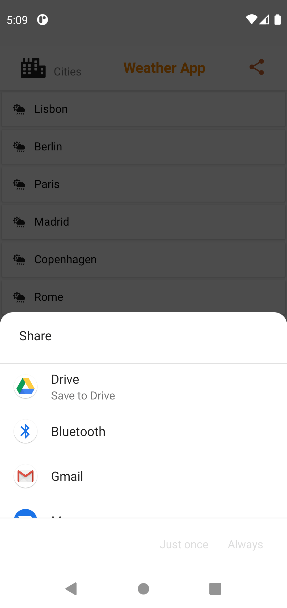

# Weather APP

Weather App is an android application that fetches data from an open weather map API and populates various views in the android application.

## Installation

Use the link provided if you want to run the app on an emulator or an android phone. The application will require internet access. The apk file must be permitted to run on one's device.


## Technologies used
1. Android Studio
2. Java8
3. Open weather Map Api
4. Font Awesome Icons


```

## Usage(Libraries)

```build.gradle
dependencies {

    implementation 'androidx.appcompat:appcompat:1.2.0'
    implementation 'com.google.android.material:material:1.3.0'
    implementation 'androidx.constraintlayout:constraintlayout:2.0.4'
    testImplementation 'junit:junit:4.13.2'
    androidTestImplementation 'androidx.test.ext:junit:1.1.2'
   

    implementation 'com.jakewharton:butterknife:10.2.3'
    implementation 'com.squareup.retrofit2:retrofit:2.9.0'
    implementation 'com.squareup.retrofit2:converter-gson:2.7.2'
    annotationProcessor 'com.jakewharton:butterknife-compiler:10.2.3'

    implementation 'info.androidhive:fontawesome:0.0.5'
    implementation 'com.google.code.gson:gson:2.8.6'
    implementation 'javax.persistence:persistence-api:1.0'
    implementation "javax.annotation:jsr250-api:1.0"
}
```

## Live links

[ApkFab Live Link](https://apkfab.com/weather-app/com.example.weatherapp/apk?h=bb2de32da8f30c2c5a451db232407632f52345eb16ab75572e879e7896969112)

## Contacts
[Portfolio](https://michaelodera.github.io)

## Screenshot



## Contributing
Pull requests are welcome. For major changes, please open an issue first to discuss what you would like to change.

Please make sure to update tests as appropriate.

## License
[MIT](https://choosealicense.com/licenses/mit/)